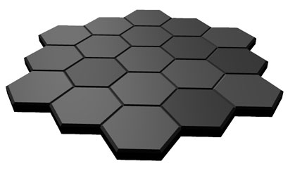

# Hexagonal and square grid systems

I never found a good (and free!) library for creating perfect hexagons and arranging them in a grid. But I did find [Amit's wonderful explanation](http://www.redblobgames.com/grids/hexagons/), and finally had the time to throw something together.

I created a hex grid (hex-shaped made with hexes) as a base, and maybe I (you?) will add more functionality, like sparse/non-uniform maps, data import (perhaps an editor?), and obviously Amit's stuff on pathfinding and other traversal features.

I also created a square grid to help me think about how to abstract the grid enough to build a decent API for, so you should be able to use the `Board` class with whatever grid you want, provided you implement the interface.

Please use this to make awesome hex-based games.

## Features

- Simple API for attaching objects to the grid through `Board.js`
- Mouse interaction with the grid's cells (over, out, down, up, click)
- Programmatic geometry, allow you to precisely adjust every aspect of the hexagon
- Adjustable properties: cell size, grid size, mouse interactivity, perfect rotation, "flat" and "pointy" versions, cell bevel