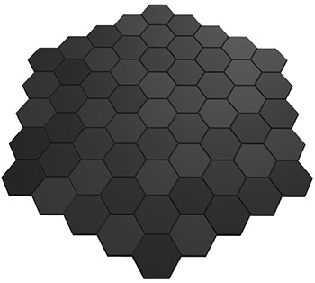
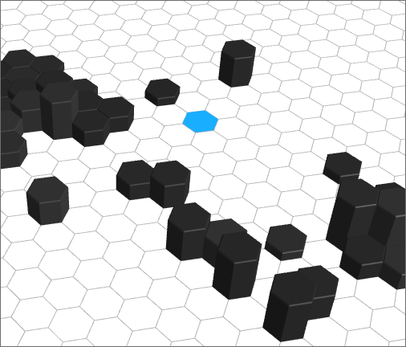

# 3D hex tile system


I never found a good (and free!) library for creating perfect hexagons and arranging them in a grid. But I did find [Amit's wonderful explanation](http://www.redblobgames.com/grids/hexagons/), and finally had the time to throw something together.

You can use the `Board` class with different graph types (hex and square), or you can make your own if you implement the interface.

Please use this to make awesome hex-based web games. Or port the code and make awesome hex games there. Just make awesome hex games, ok?

## Features

- Simple API for attaching objects to the grid through `Board.js`
- **A* pathfinding** with or without weighted nodes, and a `walkable` flag
- Make maps with [the editor](http://vonwolfehaus.github.io/von-grid/editor/) (autosaves to localstorage, and save/load as `.json` files)
- Varied height
- Sparse maps
- **Mouse interaction** with the grid's cells (over, out, down, up, click, wheel)
- Programmatic geometry, allow you to precisely adjust every aspect of the hexagon
- Square grid that can be used interchangeably
- Include only the hex grid by downloading `dist/hex-grid.js`, or all grid types with `von-grid.js`, etc

#### Roadmap

- Improved editor
- Improved API
- Abstract grid

## Usage

#### Basic board



```javascript
var scene = new vg.Scene({ // I made a very handy util for creating three.js scenes quickly
	cameraPosition: {x:0, y:150, z:150}
}, true); // add orbit controls

var grid = new vg.HexGrid({
	rings: 4
});

var board = new vg.Board(grid);

board.generateTilemap();

scene.add(board.group);
scene.focusOn(board.group);

update();

function update() {
	scene.render();
	requestAnimationFrame(update);
}
```

#### Examples

For the simple examples you can drop them into Chrome, but for ones that require images or models, you'll have to run `gulp examples`. A browser tab will be opened to the examples directory for you.

## Editor

#### [Try it out](http://vonwolfehaus.github.io/von-grid/editor/)

